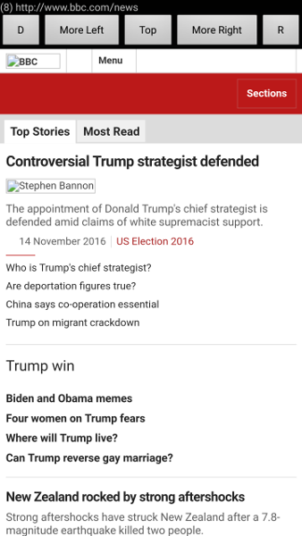

# AndroidNewsCoverage

This is an Android Studio project for an Android app that displays news sites in a WebView.

The header has some navigation buttons.

* D - Switches to the far left news site

* More Left - Switches to a news site that is more liberal

* Top - Navigates to the top level of the news site

* More Right - Switches to a news site that is more conservative

* D - Switches to the far right news site

This app is inspired by the article [What I Discovered About Trump and Clinton From Analyzing 4 Million Facebook Posts](https://shift.newco.co/what-i-discovered-about-trump-and-clinton-from-analyzing-4-million-facebook-posts-922a4381fd2f#.eiq8vpcrc).

